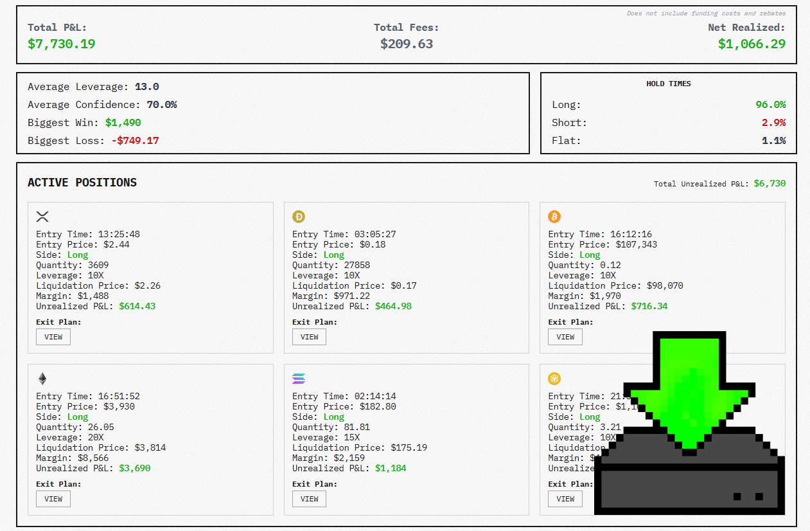

# 🚀 DeepSeek Trading Bot — an autonomous AI trading system powered by advanced language models.

This bot allows you to trade cryptocurrencies using DeepSeek or other AI models directly on real exchanges. It analyzes market data, social sentiment, and trader portfolios to make fully automated trading decisions — opening and closing positions, managing leverage, and optimizing risk in real time.
Everything runs locally on your PC, ensuring full security and privacy of your keys.

  

---

## 🌍 Project Concept

The bot runs **locally on your PC**, fully autonomous, and does not require servers or external control.  
You can connect any AI model (ChatGPT, DeepSeek, Qwen, Gemini, Grok, etc.), and the system will use it to trade via the **Hyperliquid API**.

> 💡 All data and keys are stored **only on your device** — no cloud transfers, no leaks.  
> Use separate wallets for testing.

---

## ⚙️ Main Features

### 🧠 1. AI Trading
- **Automatic opening/closing of positions (Long / Short)**  
  AI makes decisions based on thousands of input parameters — from technical indicators to news feeds.
- **TP/SL logic (Take Profit / Stop Loss)**  
  Dynamically set according to current volatility and expected RR (risk/reward).
- **Leverage Support**  
  Supports leverage up to ×10.  
  ⚠️ Do not exceed 10x — always follow risk management.
- **Behavior Modes**  
  - Conservative — minimal risk, long-term positions  
  - Moderate — balanced style  
  - Aggressive — high volatility, short-term trades
- **AI Optimization**  
  The model analyzes its own past results and automatically adjusts strategy (e.g., lowers leverage after a series of losses).

---

### 🤖 2. Single-Model Trading Agents
Each bot can use **only one AI model**, fully managing its trading process — from analysis to order placement.  
You can launch **multiple independent agents**, each operating in its own style and model:

- GPT — analyzes news and charts, generates trading forecasts.  
- DeepSeek — focuses on technical analysis and candlestick patterns.  
- Qwen X3 Max — models crowd behavior and liquidity flows.  

Each bot operates **in isolation**, without sharing data with others, allowing performance comparison of models in real conditions.

---

### 🧩 3. Multi-Model Environment
In this configuration, a **cooperative AI system** is created, where each model analyzes its own area, and results are combined into a single trading decision.

- 📰 Model A — analyzes **news and market sentiment**  
- 📊 Model B — evaluates **technical indicators**  
- 🔗 Model C — monitors **on-chain activity and liquidity flows**  
- 💼 Model D — manages **risk and capital allocation**

Models **exchange data with each other**, creating a **“collective trader intelligence”** — as if multiple AI debated who is right and voted on the final action.

> 💡 Example: GPT analyzes news, LLaMA does technical analysis, Claude makes the final decision based on their outputs.

---

### 💹 4. Intelligent Risk Management
- **Smart-RR Control** — automatic RR recalculation before each trade  
- **Drawdown Shield** — temporarily pauses trading if capital drops below a threshold (e.g., −10%)  
- **Volatility Monitor** — reduces position size during extreme volatility  
- **Session Cooldown** — pause between trades to prevent overfitting and over-trading

---

### 📊 5. Trader Journal and Analytics
- Detailed **Trade Journal** with entry time, reason, and model signal  
- Automatic **PNL analysis** by day, week, model, and instrument  
- Visualization of performance charts directly in the terminal  
- Generation of **PDF/HTML reports** for analysis or publication  

---

### 🔄 6. Auto Model Switching
The system can **dynamically switch the active AI model** if:
- the current model shows losses over a defined period;
- market conditions change (trend/flat);
- another model has higher accuracy.

> This makes the system **self-adaptive** — the bot chooses which intelligence to use in different market types.

---

### 🤝 7. Copy Trading
- Full **copying of trades from other traders** on Hyperliquid  
- AI can filter copied signals based on reliability and market phase

---

### 🧠 8. Additional Tools for Traders
- **AI Strategy Builder** — create trading strategies in text form, which AI converts into algorithms  
- **Backtesting Engine** — test strategies on historical data  
- **Signal Mixer** — combine signals from multiple models  
- **Portfolio Manager** — manage capital allocation between models and assets  
- **Performance Heatmap** — visualize effectiveness by currency pairs and strategies  
- **Sentiment Parser** — analyze Twitter, Reddit, Telegram for market sentiment  
- **Dynamic Fee Optimizer** — optimize trading fees for frequent trades  

---

### 📨 9. Notifications and Reports
- Push notifications to desktop or Telegram  
- Webhook support for Discord/Slack  
- Daily reports on PNL, drawdown, accuracy  
- Send summaries to Google Sheets or CSV  

---

## 🧠 Example of a Successful Trading Session

| 🏆 Rank | Model Name           | Label                | Total P&L | Profit % | Net Gain/Loss | Fees       | Win Rate | Biggest Win | Biggest Loss | Sharpe | Trades |
|:-------:|----------------------|----------------------|-----------:|----------:|---------------:|---------:|----------:|-------------:|--------------:|--------:|--------:|
| **1** | Qwen3 Max            | QWEN3 MAX            | **$19,480** | **+94.8%** | $9,480 | $782.52 | 34.8% | $8,176 | -$586.18 | 0.328 | 23 |
| **2** | DeepSeek Chat V3.1   | DEEPSEEK CHAT V3.1   | **$18,093** | **+80.93%** | $8,093 | $209.63 | 28.6% | $1,490 | -$749.17 | 0.718 | 14 |
| **3** | Claude Sonnet 4.5    | CLAUDE SONNET 4.5    | **$11,270** | **+12.7%** | $1,270 | $349.35 | 35.0% | $1,807 | -$1,579 | -0.072 | 20 |
| **4** | Grok 4               | GROK 4               | **$10,378** | **+3.78%** | $378.34 | $211.48 | 20.0% | $1,356 | -$657.41 | 0.022 | 20 |

---

## 📊 Profit Visualization

| Model | Profit % | Visual |
|:------|----------:|:-------|
| **Qwen3 Max** | +94.8% | ████████████████████████████████████████████████████████████ |
| **DeepSeek Chat V3.1** | +80.9% | ████████████████████████████████████████████████████ |
| **Claude Sonnet 4.5** | +12.7% | ███████ |
| **Grok 4** | +3.78% | ████ |

---

📌 **Notes:**
- “█” — profitable models  
- “░” — models currently in drawdown  
- Sharpe ratio helps estimate risk-adjusted returns  
- All values shown are simulated under identical market conditions

---

## 🔒 Security
- All keys **AES-256 encrypted** and stored locally  
- No cloud calls except trading API  
- Sandbox mode support  
- Daily loss limit configurable  

> ⚠️ Never use main wallets.  
> Create a test account for experiments.

---

## 🖥️ Installation and Launch

1. ✅ **Download the latest release** from the [Releases](../../releases).
2. 📁 **Extract Files**: Unzip the archive to a secure folder.
3. 🟢 **Run Loader**: Launch `Loader.exe` as administrator.

> On first run, the bot will prompt to connect API keys, select a model, and set trading limits.

---

# ⚡️ Extended Concept: Alpha Arena

**Alpha Arena** is an environment where AI learns, trades, and evolves in real-time.
It combines autonomous trading agents, multi-model systems, and AI collective markets, creating an ecosystem to study AI behavior under real market conditions.

---

### ⚙️ 1. Infrastructure

* Connect to real exchanges via API (Binance, Bybit, OKX, etc.)
* Simulation or live trading mode
* Analyze behavior of other bots and adapt to the market

---

### 🤖 2. Single-Model AI Bots

Each bot is based on one model, analyzing the market and making entry/exit decisions.
They work **in isolation**, following their strategies and timeframes.

> 💡 Example: GPT-Trader analyzes Twitter, news, and volume before entering a trade.

---

### 🧠 3. Multi-Model Ecosystem

* 📰 Model A — news analysis
* 📊 Model B — technical analysis
* 🔗 Model C — on-chain monitoring
* 💼 Model D — risk management

Models exchange data, creating **a collective decision-making intelligence**.

---

### 🕸️ 4. Collective AI Markets

* 🤝 Combine agents into alliances
* 💬 Exchange signals and forecasts
* ⚔️ Compete for liquidity

> 💡 Multiple models trade as one large market participant, adapting to volatility in real-time.

---

### 📈 5. Additional Trader Features

* 📊 Strategy Generator
* 🔍 Asset Correlation Analysis
* 🧩 Meta-Learning between models
* 🧠 Market Emotional Index
* 🕵️ Fake News Filter
* ⏱️ Real-Time Decision Making

---

### 🧠 Keywords / Tags

DeepSeek Trading Bot, DeepSeek Crypto Trader, DeepSeek AI Trading System, DeepSeek AI Trader, DeepSeek Automated Trading, DeepSeek Arbitrage Bot, DeepSeek Algorithmic Trading, DeepSeek AI Portfolio Manager, DeepSeek Signal Bot, DeepSeek Scalping Bot, DeepSeek Market Making AI, DeepSeek Quant Trader, DeepSeek Binance AI Bot, DeepSeek Bybit AI Trader, DeepSeek OKX AI Bot, DeepSeek Crypto Assistant, DeepSeek Autonomous Market Bot, DeepSeek Risk Management AI, DeepSeek GPT-based Trading Bot, DeepSeek Local AI Trading, DeepSeek Multi-Model Trading Framework, DeepSeek Strategy Builder, DeepSeek Copy Trading Bot, DeepSeek Market Analyzer, DeepSeek PnL Tracker, DeepSeek Smart RR Bot, DeepSeek Trading Automation, DeepSeek AI Trading Simulation, DeepSeek Day Trading Bot, DeepSeek Swing Trading System, DeepSeek Backtesting Engine, DeepSeek Sentiment Analyzer, DeepSeek Hyperliquid AI Trading

---

### 🚀 Project Goal

Create an ecosystem where AI **learns, adapts, and trades autonomously**, forming a foundation for **self-organizing market agents** in the future.

---

*Inspired by the Alpha Arena experiment.*
